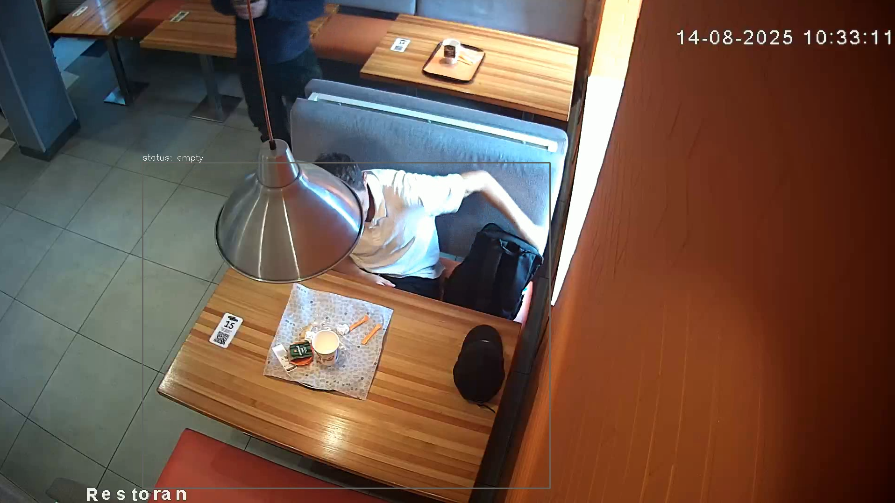

# Тестовое задание
Проект выполнен в соответствии с требованиями [тестового задания](docs%2Ftest2.docx)

## Общая информация
- выбранное видео: "видео 2.mp4"
- столик: [представлен в разделе проблемного кадра](#проблемный-кадр)
- выходное видео: [output.mp4](https://drive.google.com/file/d/1WLjkA4gNsZSYqNv74ukBTH1DF3oZlOxB/view?usp=drive_link)

Вся основная логика реализуется в классе TableMonitor.
Основные параметры:
- window - двусвязный список длиной N (N = FPS * debounce_sec) - 
хранит последние N  
состояний  кадров. Под состоянием понимается булево значения 
1 - есть человек, 0 - нет человека. Т.е хранит информацию есть/был ли человек в 
в кадре за последние debound_sec времени видео
- debounce_sec - пороговое количество секунд для изменения состояния 
(по-умолчанию = 3)

## Логика детекции
Для определения есть ли человек в зоне интереса используется следующий алгоритм:
1. детекция людей в кадре посредством YOLO
2. извлечение координат bounding box всех людей в кадре (если есть)
3. вычисление координаты центра bounding box человека. Если его
центр находится внутри зоны интереса возвращается True (1) иначе False (0)
4. заполнение двусвязного списка булевыми состояниями кадра (1 / 0)

## Логика измененния состояния (конечный автомат)
1. EMPTY

 - > APPROACH человек был в зоне интереса хотя бы раз за последние debounce_sec
   (хотябы 1 из кадров в window = 1)
2. APPROACH

   - > OCCUPIED:
   человек в зоне интереса все время за последние debounce_sec 
      (все кадры в window = 1)
   - > EMPTY:
   в зоне интереса нет людей за последние debounce_sec 
   (все кадры в window = 0)

3. OCCUPIED 
   - > EMPTY: в зоне интереса нет людей за последние debounce_sec 
   (все кадры в window = 0)
     

## Структура проекта

- main.py - исходный код программы

## Запуск

Для запуска программы требуется установить зависимости python
и запустить скрипт main.py, передав ему в качестве параметра
входной видеофайл

1. клонирование репозитория
```commandline
git clone http://whatever.git -b branch-name
```

2. создать и активировать вртуальное окружение (если не создано)
```commandline
python -m venv .venv && .venv\Scripts\activate
```

3. установка зависимостей 

```commandline
pip install -r requirements.txt
```
4. запуск программы

```commandline
python main.py --video input.mp4
```

(убедитесь что в имени файла отсутствуют пробелы, или передавайте параметр в кавычках "input 1.mp4")
5. деактивировать виртуальное окружение
```commandline
deativate
```

так же возможно передать опциональный параметр headless (по-умолчанию true)
которые принимает булевы значения (true/false) и отвечает за то, нужно ли
выводить окно с процессом обработки видеофайла (false - выводить, true - не
выводить)

например: 
```commandline
python main.py --video input.mp4 --headless false
``` 

## Проблемный кадр
Человек перекрыт лампой, из-за чего модель считает что людей в кадре нет.



Возможные решения:
- увелечить время debound_sec, если увеличение задержки не критично
- использовать более новую версию модели (требуются тесты на быстродействие)
- использовать детекцию движения (вычитание фона), этот вариант подходит
для данного столика, но может потребовать отдельной настройки, 
т.к, например, в "видео 3.mp4" в кадре над столиком присутствует постоянно 
качающаяся лампа