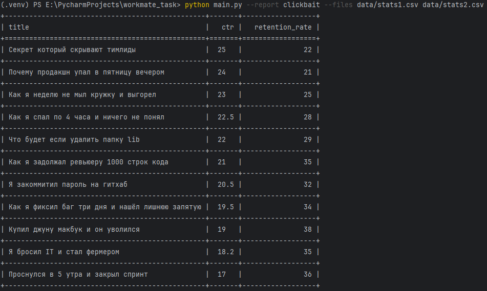

# Тестовое задание

## Структура проекта

```commandline
├───data                        # входные данные
│       stats1.csv
│       stats2.csv
│
├───docs
│       example_launch.png      # тестовый запуск
│       TZ.docx
│
├───reports
│   │   base.py                 # абстракция для добавления новых отчетов
│   │   reports.py              # модуль для определения логики создания отчетов
│   └───__init__.py
│   
│   
│
├───tests
│       conftest.py
│       test_csv_reader.py      # тесты для объекта-читателя файлов
│       test_get_args.py        # тесты чтения аргементов CLI
│       test_reports.py         # тесты по видам отчетов
│
│
├───csv_reader.py               # модуль с определением логики чтения данных
│
├───main.py                     # точка входа в программу
│
└───models.py                   # dataclasses для работы с данными
```

## Функционал
Функционал проекта исполнен в соответствии с требованиями 
[технического задания](docs/TZ.docx)
.

Для добавления нового отчета требуется 
(пути указаны относительно директории reports):
1. в модуле reports.py создать класс, наследуемый от 
абстрактного класса base.py/ConsoleReport
3. определить метод с логикой 
обработки данных "_process" в вашем классе
4. зарегистрировать ваш класс в словаре reports.REPORTS

Примечание: метод "_process" по умолчанию должен возвращать список
словарей с данными, при необходимости можно возвращать список
объектов dataclass, для этого нужно определить новый dataclass в 
модуле models.py с необходимыми атрибутами

## Пример запуска скрипта


## Запуск
1. клонирование репозитория
```commandline
git clone https://github.com/TwentyOn/test_tasks.git -b workmate_task && cd test_tasks
```
2. создать и активировать вртуальное окружение (win cmd)
```commandline
python -m venv .venv && .venv\Scripts\activate
```
3. установка зависимостей
```commandline
pip install -r requirements.txt
```
4. получить отчет
```commandline
python main.py --report clickbait --files data/stats1.csv data/stats2.csv
```
5. запуск тестов
```commandline
pytest
```
